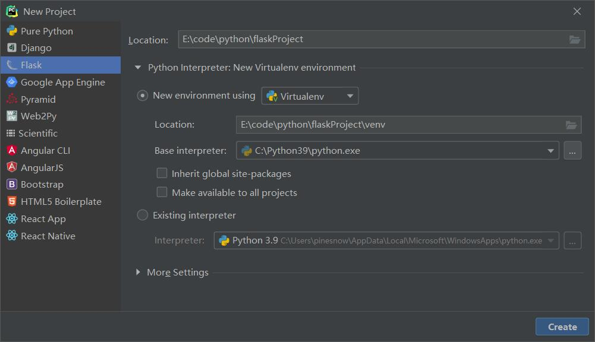

# 新建项目

## 通过命令行
- 打开 `cmd` / `powershell`
- `cd` 进入到要创建项目的文件夹
- 然后用 `mkdir` 创建目录，例如：`mkdir myweb`
- `cd myweb`
- 创建python虚拟环境 `python -m venv venv`
- 激活虚拟环境 `venv\Scripts\activate.bat` 如果是在 `PowerShell` 中，执行 `venv\Scripts\activate.ps1`
- 安装 `Flask` 执行 `pip install flask`

## 通过 `Pycharm Professional` 创建

- 打开 `Pycharm Professional`
- 点击菜单中的 “File”
- 点第一个 “New Project...”
- 在弹出框中左侧点击 ‘Flask’
- 在 Location 中选择项目存放位置，下边的选项默认不用动
