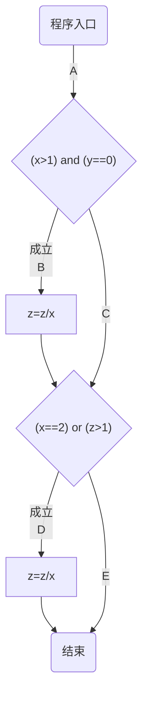
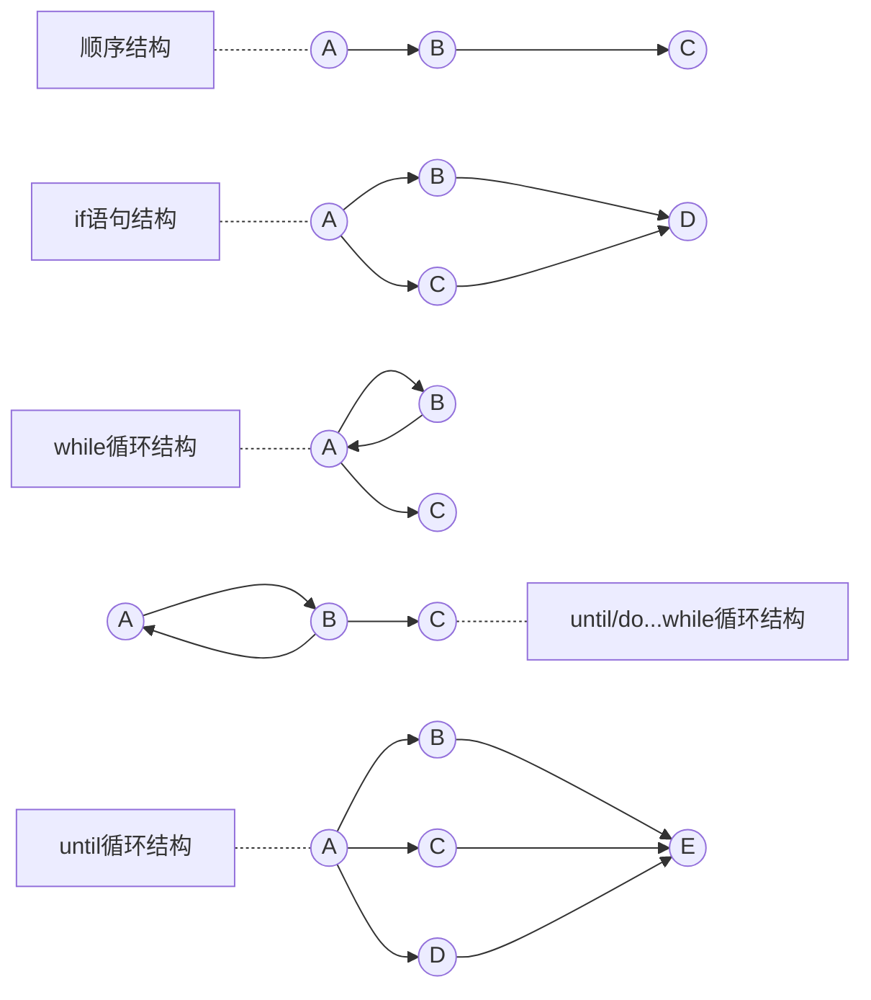
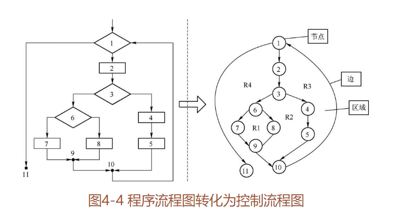

# 白盒测试

[TOC]

白盒测试就是有代码可以阅读，可以通过阅读代码的方式进行的测试

## 白盒测试常用的技术

### 静态测试
1. **控制流分析**：将程序的流程图转化为控制流程图借助算法进行控制分析
2. **数据流分析**：根据代码得到的数据流进行分析，主要关注数据的定义和引用
3. **信息流分析**：根据输入变量、语句的关系以及输出的变量三者之间的关系表进行分析
4. **代码评审**：代码评审在开发组内部进行，**主要检查**：
   1. 代码和设计的一致性
   2. 代码对文档标准的遵循以及代码的可读性
   3. 代码的逻辑表达式正确性
   4. 代码结构的合理性。

**代码评审比动态测试更有效率，能快速找到70%左右的逻辑设计上的错误和代码缺陷**

**代码评审的实施方法：**

- 代码走读：非正式评审，通过人工阅读和轮查的方式来找错误，主要 检查代码是否符合标准、规范和风格等。比如：缩进用4个空格代替水平制表符`\t`，变量名用小驼峰，类名用首字母大写的单词等
- 代码审查：属于正式评审。通常由开发组长组织代码审查，主要检查是否存在逻辑错误的问题以及算法实现方面的问题。

### 动态测试

#### 程序插装：

对程序的路径和分支中设计程序插装。即就是**在程序中插入一些打印语句**，目的在于**在程序执行时打印我们最为关注的信息**

#### 逻辑覆盖测试

Python版示例程序如下
```python
if (x > 1 and y == 0):
	z = x / y
if (x == 2 or z > 1):
	z = x + 1
```

样式流程图如下


标准流程图如下
```flow
st=>start: 程序入口A
op1=>operation: z=z/x
op2=>operation: z=z+1
cond1=>condition: (x>1) and (y==0)
cond2=>condition: (x==2) or (z>1)
e=>end: 结束
st->cond1->
cond1(yes)->op1->cond2
cond2(yes)->op2->e
cond1(no)->cond2
cond2(no)->e
```

1. **语句覆盖：**在程序运行时，设计足够的测试数据，使被测程序中没一个语句至少被执行一次，

   |     条件      |      优点      |       缺点       |              错误程序               |                错误程序的结果                |
   | :-----------: | :------------: | :--------------: | :---------------------------------: | :------------------------------------------: |
   | x=2，y=0，z=3 | 语句覆盖率100% | 无法测试隐藏条件 | 如果开发人员将第一个if中的and写成or | 语句覆盖率依然100%，但是无法发现程序中的错误 |

2. 判定覆盖（分支覆盖）：每个if的逻辑真和假都走一遍，也就是**括号里的内容整体的真和假**

   | 编号 | 条件          | 优点                 | 错误程序                   |                                                  |
   | ---- | ------------- | -------------------- | -------------------------- | ------------------------------------------------ |
   | 1    | x=2，y=0，z=3 |                      |                            |                                                  |
   | 2    | x=1，y=0，z=1 | 整体的判定覆盖率100% | 将第二个条件中的x>1写成x<1 | 判定覆盖率依然为100%，但无法发现程序找哪个的错误 |

   

3. 条件覆盖：所有判断语句的每个条件的真假都走一遍（**如果都是单条件，则等价于上边的判定覆盖**）

   | 编号 |     数据      |      优点      |      缺点      |
   | :--: | :-----------: | :------------: | :------------: |
   |  1   | x=2，y=0，z=3 |                |                |
   |  2   | x=1，y=1，z=1 | 条件覆盖率100% | 判定未满足100% |
   
   
   
4. 判定条件覆盖：每个条件真假都走并且小括号整体真假也都走一遍
	
   | 编号 | 条件    | 标记    |
   | ---- | ------- | ------- |
   | 1    | x>1,y=0 | T1，T2  |
   | 2    | x>1,y≠0 | T1，F2 |
   | 3    | x≤1,y=0 | F1，T2 |
   | 4    | x≤1,y≠0 | F1，F2 |
   | 5 | x=2,z>1 | T3,T4 |
   | 6 | x=2,z≤1 | T3,F4 |
   | 7 | x≠2,z>1 | F3,T4 |
   | 8 | x≠2,z≤1 | F3,F4 |
   
   ​	覆盖情况
   
   |     数据      | 组合编号 | 条件判定       | 经过的路径（参考上边样式流程图） | 两个表达式的整体条件 |
   | :-----------: | :------: | -------------- | :------------------------------: | -------------------- |
   | x=2，y=0，z=3 |   1、5   | T1、T2、T3、T4 |               ABD                | 成立、成立           |
   | x=2，y=1，z=1 |   2、6   | T1、F2、T3、F4 |               ACD                | 不成立、成立         |
   | x=1，y=0，z=3 |   3、7   | F1、T2、F3、T4 |               ACD                | 不成立、成立         |
   | x=1，y=1，z=1 |   4、8   | F1、F2、F3、F4 |               ACE                | 不成立、不成立       |
   
   > 注：在表达式`x > 1 and y == 0`中，`x>1`取值为真记作`T1`、为假记作`F1`；`y==0`取值为真记作`T2`、为假记作`F2`；
   >
   > 在表达式 `x == 2 or z > 1`中，`x == 2`取值为真记作`T3`、为假记作`F3`；`z > 1`取值为真记作`T4`、为假记作`F4`；
   
   漏掉了ABE即第一个表达式成立第二个表达式不成立的情况，所以判定条件覆盖还不是最完整的覆盖，无法满足对程序的完整测试，还需要考虑路径覆盖
   
5. 路径覆盖


## 基本路径测试

基本路径测试法是在白盒测试最为广泛的一种测试方法，它是一种通过程序的流程图，将其转化为程序控制流图，然后分析控制结构的环形复杂性，导出基本可执行路径集合，最后进行测试用例设计的方法。

### 控制流

控制流程图是以图形的方式用来描述控制流的一种方法。在控制流程图中**只有圆圈和箭头两种符号**，圆圈表示程序流程图中的矩形框和菱形框的功能，也叫**节点**。箭头用来表示控制的顺序，也称为**边**



### 基本路径测试法的步骤

1. 将程序的流程图转化为控制流程图，如下图

   

   图中有节点11个，边13条，区域4个（R1、R2、R3、R4），判定节点3个①、③、⑥。

2. 计算控制流程图的**圈复杂度**。

3. 确认独立路径的集合。

   图4-4中有四条独立的路径，它们分别为：

   - 路径1：1-11。
   - 路径2：1-2-3-4-5-10-1-11。
   - 路径3：1-2-3-6-8-9-10-1-11。
   - 路径4：1-2-3-6-7-9-10-1-11。

4. 生成测试用例,确保基本的路径集中每一条路径的执行。

#### 圈复杂度

**圈复杂度**是一种为程序逻辑复杂性提供定量测度的软件度量，将该度量用于计算程序的基本的独立路径数目，为确保所有语句至少执行一次的测试数量的上界。**独立路径必须包含一条在定义之前未曾用到的边。**

有以下三种**计算圈复杂度的方法：**

1）流图中区域的数量就是圈的复杂度。

2）控制流程图中，边的总数减去节点总数再加2。

3）控制流程图中，判定节点加1。

## 白盒测试的优缺点

优点：

- 检测代码中的每条分支和路径，对代码的测试比较充分。

- 可以揭示一些隐藏在代码中的缺陷或者错误。

- 可以迫使测试人员仔细思考软件是如何实现的。

缺点：

- 对软件规格的正确性不进行验证。

- 对测试人员的要求非常高，必须要有一定的开发经验，能编写测试驱动或者测试桩。
- 由于成本也是比较昂贵，所以现在大多数企业都不进行白盒测试，一般都是有开发人员来负责。


