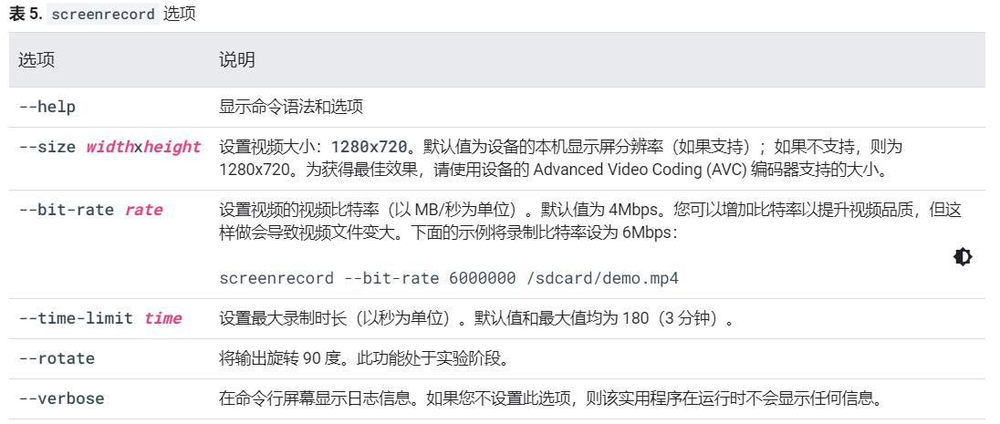

# adb命令

可参考官方文档 https://developer.android.google.cn/studio/command-line/adb

[toc]

## adb devices

查看连接的设备
其中：
- `offline`：表示设备未连接到adb或者没有响应
- `device`：设备现已连接到 adb 服务器。请注意，此状态并不表示 Android 系统已完全启动并可正常运行，因为在设备连接到 adb 时系统仍在启动。不过，在启动后，这将是设备的正常运行状态。
- `no device`：未连接任何设备。

```powershell
# 查看所有连接的设备
PS C:\Users\pinesnow> adb devices
List of devices attached
94dda289        device

# 查看连接设备的详情，例如设备型号之类的
adb devices -l
```

## adb tcpip

设置监听端口号，部分安卓10版本之后开始支持wifi调试
```bash
adb tcpip 5555
```
设置完之后就可以断开USB，用网络环境调试了

## adb connect
连接到设备

```bash
adb connect 设备ip
```

## adb start-server

重新连接设备

## adb kill-server

断开设备,之后方便配合`adb start-server`重新连接

## adb install

安装App
```powershell
# 安装App
adb install *.apk

# 安装App到指定设备，用于连接着多个设备时 “emulator-5555”是adb devices 看到的第一字段设号
adb -s emulator-5555 install *.apk
```

## adb pull/push 复制文件

```
# 从设备复制到电脑
adb pull remote local

# 从电脑推送到设备
adb push local remote
# 示例
adb push foo.txt /sdcard/foo.txt
```

## adb shell

### am 调用 Activity 管理器

在 adb shell 中，您可以使用 Activity 管理器 (am) 工具发出命令以执行各种系统操作，如启动 Activity、强行停止进程、广播 intent、修改设备屏幕属性，等等。在 shell 中，相应的语法为：

```sh
am command
```
您也可以直接从 adb 发出 Activity 管理器命令，无需进入远程 shell。例如：

```sh
adb shell am start -a android.intent.action.VIEW
```
更多命令参考来自官方文档的截图


### pm 调用软件包管理器

在 adb shell 中，您可以使用软件包管理器 (pm) 工具发出命令，以对设备上安装的应用软件包执行操作和查询。在 shell 中，相应的语法为：

```sh
pm command
```
您也可以直接从 adb 发出软件包管理器命令，无需进入远程 shell。例如：

```sh
adb shell pm uninstall com.example.MyApp
```
更多可用的软件包管理器命令参考来自官方文档的截图


### dpm 调用设备政策管理器

为便于您开发和测试设备管理（或其他企业）应用，您可以向设备政策管理器 (dpm) 工具发出命令。使用该工具可控制活动管理应用，或更改设备上的政策状态数据。

> 具体参考官方文档：[调用设备政策管理器 (dpm)](https://developer.android.google.cn/studio/command-line/adb#dpm)

### screencap 屏幕截图

```sh
# 格式
screencap filename

# 示例：
adb shell screencap /sdcard/screen.png
```

### screenrecord 录制视频
在 shell 中，使用以下语法：

```
# 格式
screenrecord [options] filename

# 示例
adb shell screenrecord /sdcard/demo.mp4
```
更多可用参数参考来自官方文档的截图


### 读取应用的 ART 配置文件
从 Android 7.0（API 级别 24）开始，Android Runtime (ART) 会收集已安装应用的执行配置文件，这些配置文件用于优化应用性能。您可能需要检查收集的配置文件，以了解在应用启动期间，系统频繁执行了哪些方法和使用了哪些类。

要生成文本格式的配置文件信息，请使用以下命令：

```sh
adb shell cmd package dump-profiles package
```
要检索生成的文件，请使用：

```sh
adb pull /data/misc/profman/package.txt
```

### 重置测试设备
如果您在多个测试设备上测试应用，则在两次测试之间重置设备可能很有用，例如，可以移除用户数据并重置测试环境。您可以使用 `testharness` adb shell 命令对搭载 Android 10（API 级别 29）或更高版本的测试设备执行恢复出厂设置，如下所示。

```sh
adb shell cmd testharness enable
```

使用 `testharness` 恢复设备时，设备会自动将允许通过当前工作站调试设备的 RSA 密钥备份在一个持久性位置。也就是说，在重置设备后，工作站可以继续调试设备并向设备发出 adb 命令，而无需手动注册新密钥。

此外，为了帮助您更轻松且更安全地继续测试您的应用，使用 `testharness` 恢复设备还会更改以下设备设置：

- 设备会设置某些系统设置，以便不会出现初始设备设置向导。也就是说，设备会进入一种状态，供您快速安装、调试和测试您的应用。
- 设置：
  - 停用锁定屏幕
  - 停用紧急提醒
  - 停用帐户自动同步
  - 停用自动系统更新
- 其他：
  - 停用预装的安全应用


如果您的应用需要检测并适应 `testharness` 命令的默认设置，您可以使用 [ActivityManager.isRunningInUserTestHarness()](https://developer.android.google.cn/reference/android/app/ActivityManager#isRunningInUserTestHarness())。