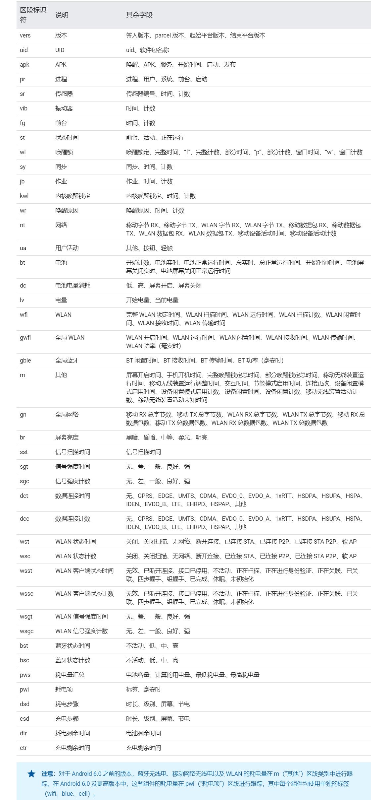

# dumpsys

[toc]

dumpsys 是一种在 Android 设备上运行的工具，可提供有关系统服务的信息。您可以使用 Android 调试桥 (ADB) 从命令行调用 dumpsys，获取在连接的设备上运行的所有系统服务的诊断输出。此输出通常比您想要的更详细，因此您可以使用下文所述的命令行选项仅获取您感兴趣的系统服务的输出。本页还介绍了如何使用 dumpsys 完成常见的任务，如检查输入、RAM、电池或网络诊断信息。

参考文档 https://developer.android.google.cn/studio/command-line/dumpsys

## 测试界面性能
如果指定 gfxinfo 服务，输出中会包含录制阶段所发生的动画帧的相关性能信息。以下命令使用 gfxinfo 收集指定软件包名称的界面性能数据：

```sh
adb shell dumpsys gfxinfo package-name
```
您还可以包含 framestats 选项，以提供有关最近发生的帧的更加详细的帧时间信息，让您能够更准确地找到问题并进行调试，如下所示：

```sh
adb shell dumpsys gfxinfo package-name framestats
```
如需详细了解如何使用 gfxinfo 和 framestats 将界面性能测量值集成到您的测试实践中，请转到[测试界面性能](https://developer.android.google.cn/training/testing/performance)。

## 检查网络诊断信息 
指定 netstats 服务可提供自设备上次启动以来收集的网络使用情况统计信息。要输出额外信息，如详细的唯一用户 ID (UID) 信息，请包含 detail 选项，如下所示：

```sh
adb shell dumpsys netstats detail
```
输出内容因连接的设备上搭载的 Android 版本不同而异。下面几部分介绍了您通常会看到的信息类型。

## 检查电池诊断信息
指定 batterystats 服务会生成关于设备电池用量的统计数据，这些数据按唯一用户 ID (UID) 进行整理。要了解如何使用 dumpsys 在低电耗模式和应用待机模式下测试应用，请转到在低电耗模式和应用待机模式下进行测试。

batterystats 的命令如下所示：


adb shell dumpsys batterystats options
要查看 batterystats 可用的其他选项列表，请添加 -h 选项。以下示例会输出自设备上次充电以来指定应用软件包的电池用量统计信息：


adb shell dumpsys batterystats --charged package-name
输出通常包含以下内容：

电池相关事件的历史记录
设备的全局统计信息
每个 UID 和系统组件的大致用电量
单个应用的每个数据包占用的移动网络毫秒数
系统 UID 汇总统计信息
应用 UID 汇总统计信息
如需详细了解如何使用 batterystats 以及如何生成 HTML 格式的可视化输出内容，以便于您理解和诊断电池相关问题，请参阅使用 Batterystats 和 Battery Historian 分析电池用量。

### 检查计算机可读格式的输出内容

您可以使用以下命令以计算机可读的 CSV 格式生成 batterystats 输出：

```
adb shell dumpsys batterystats --checkin
```
以下是您应该会看到的输出内容示例：

```
9,0,i,vers,11,116,K,L
9,0,i,uid,1000,android
9,0,i,uid,1000,com.android.providers.settings
9,0,i,uid,1000,com.android.inputdevices
9,0,i,uid,1000,com.android.server.telecom
...
9,0,i,dsd,1820451,97,s-,p-
9,0,i,dsd,3517481,98,s-,p-
9,0,l,bt,0,8548446,1000983,8566645,1019182,1418672206045,8541652,994188
9,0,l,gn,0,0,666932,495312,0,0,2104,1444
9,0,l,m,6794,0,8548446,8548446,0,0,0,666932,495312,0,697728,0,0,0,5797,0,0
...
```
电池用量检测可以基于 UID 进行，也可以在系统级别进行；是否包含某项数据是根据其对于分析电池性能的作用决定的。每一行代表一项包含以下元素的检测信息：

- 一个占位符整数
- 与检测关联的用户 ID
- 聚合模式：
    - “i”表示不与已充电/未充电状态关联的信息。
    - “l”表示已充电（自上次充电后的使用情况）。
    - “u”表示已拔下电源（自上次拔下电源后的使用情况）。在 Android 5.1.1 中已弃用。
- 区段标识符，用于确定如何解译行中的后续值。

下表介绍了您可能会看到的各个区段标识符：


## 查看内存分配

您可以通过两种方法检查应用的内存占用情况：使用 procstats 检查一段时间内的占用情况，或使用 meminfo 检查特定时间点的占用情况。以下几部分将介绍如何使用这两种方法。

### procstats
procstats 可以让您了解应用在一段时间内的表现，包括应用在后台运行的时长以及在该期间内的内存占用情况。它可以帮助您快速找到应用中的低效环节和不当行为（如内存泄漏），这些问题可能会影响应用的表现，特别是在低内存设备上运行时。其状态转储会显示有关每个应用的运行时间、按比例分摊的内存大小 (PSS)、独占内存大小 (USS) 和常驻内存大小 (RSS) 等统计信息。

要获取过去三小时内应用的内存占用情况统计信息（采用简单易懂的格式），请运行以下命令：

```
adb shell dumpsys procstats --hours 3
```
从下面的示例中可以看出，输出会显示应用运行时间的百分比，以及 PSS、USS 和 RSS（minPSS-avgPSS-maxPSS/minUSS-avgUSS-maxUSS/minRSS-avgRSS-maxRSS over 样本数）。

```cmd
AGGREGATED OVER LAST 3 HOURS:
  * com.android.systemui / u0a37 / v28:
           TOTAL: 100% (15MB-16MB-17MB/7.7MB-8.7MB-9.4MB/7.7MB-9.6MB-84MB over 178)
      Persistent: 100% (15MB-16MB-17MB/7.7MB-8.7MB-9.4MB/7.7MB-9.6MB-84MB over 178)
  * com.android.se / 1068 / v28:
           TOTAL: 100% (2.8MB-2.9MB-2.9MB/300KB-301KB-304KB/304KB-22MB-33MB over 3)
      Persistent: 100% (2.8MB-2.9MB-2.9MB/300KB-301KB-304KB/304KB-22MB-33MB over 3)
  * com.google.android.gms.persistent / u0a7 / v19056073:
           TOTAL: 100% (37MB-38MB-40MB/27MB-28MB-29MB/124MB-125MB-126MB over 2)
          Imp Fg: 100% (37MB-38MB-40MB/27MB-28MB-29MB/124MB-125MB-126MB over 2)
  ...
  * com.android.gallery3d / u0a62 / v40030:
           TOTAL: 0.01%
        Receiver: 0.01%
        (Cached): 54% (6.4MB-6.5MB-6.9MB/4.4MB-4.4MB-4.4MB/4.4MB-26MB-68MB over 6)
  * com.google.android.tvlauncher / u0a30 / v1010900130:
           TOTAL: 0.01%
        Receiver: 0.01%
        (Cached): 91% (5.8MB-13MB-14MB/3.5MB-10MB-12MB/12MB-33MB-78MB over 6)
  * com.android.vending:instant_app_installer / u0a16 / v81633968:
           TOTAL: 0.01%
        Receiver: 0.01%
        (Cached): 100% (14MB-15MB-16MB/3.8MB-4.2MB-5.1MB/3.8MB-30MB-95MB over 7)
  ...
Run time Stats:
  SOff/Norm: +32m52s226ms
  SOn /Norm: +2h10m8s364ms
       Mod : +17s930ms
      TOTAL: +2h43m18s520ms

Memory usage:
  Kernel : 265MB (38 samples)
  Native : 73MB (38 samples)
  Persist: 262MB (90 samples)
  Top    : 190MB (325 samples)
  ImpFg  : 204MB (569 samples)
  ImpBg  : 754KB (345 samples)
  Service: 93MB (1912 samples)
  Receivr: 227KB (1169 samples)
  Home   : 66MB (12 samples)
  LastAct: 30MB (255 samples)
  CchAct : 220MB (450 samples)
  CchCAct: 193MB (71 samples)
  CchEmty: 182MB (652 samples)
  Cached : 58MB (38 samples)
  Free   : 60MB (38 samples)
  TOTAL  : 1.9GB
  ServRst: 50KB (278 samples)

          Start time: 2015-04-08 13:44:18
  Total elapsed time: +2h43m18s521ms (partial) libart.so
```

### meminfo

您可以使用以下命令记录应用内存在不同类型的 RAM 分配之间的划分情况：

```cmd
adb shell dumpsys meminfo package_name|pid [-d]
```
-d 标记会输出更多与 Dalvik 和 ART 内存占用情况相关的信息。

输出列出了应用当前的所有分配，以千字节为单位。